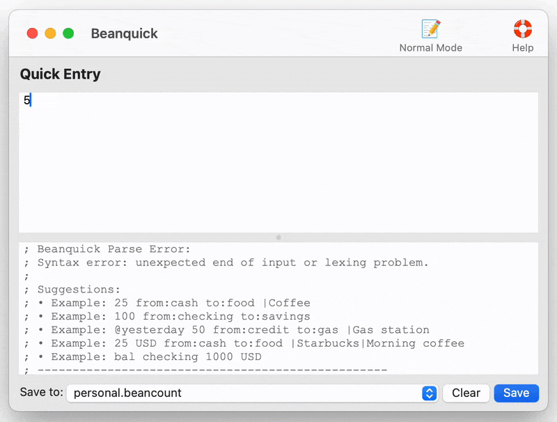
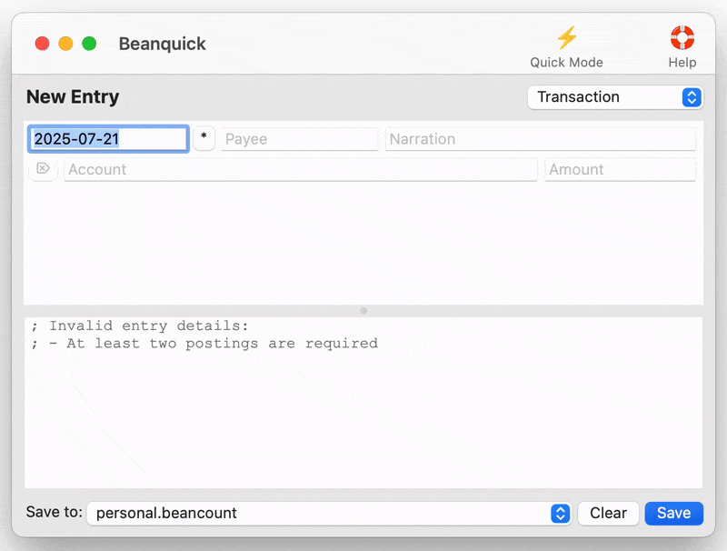
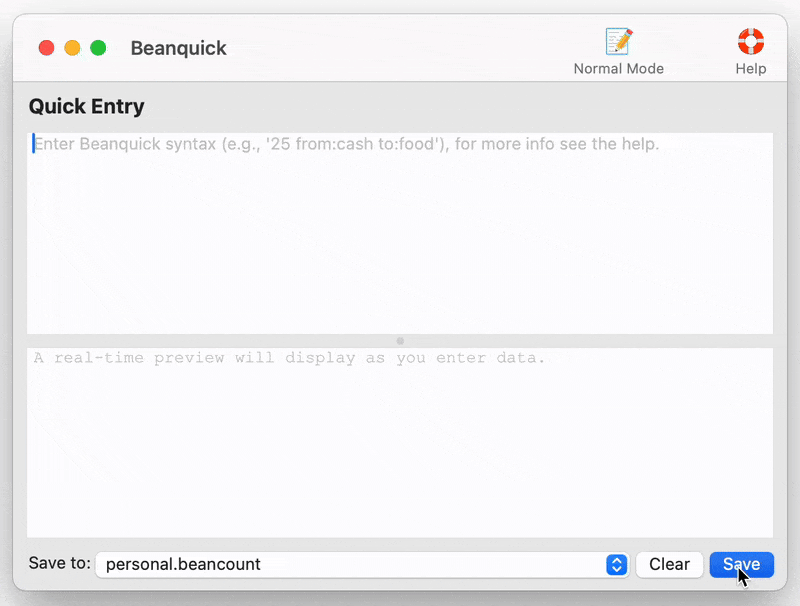

# Beanquick

**Fast, intuitive double-entry bookkeeping for everyone**

Beanquick is a cross-platform desktop application that makes financial record-keeping fast and intuitive by providing a simplified syntax for entering double-entry bookkeeping transactions. It automatically converts natural language input into properly formatted [Beancount](https://beancount.github.io/) entries.

## What is Beanquick?

Beanquick bridges the gap between the power of [Beancount](https://beancount.github.io/) and the need for speed and simplicity in daily transaction entry. Instead of writing verbose Beancount syntax, you can use natural language patterns that are converted in real-time.

**Example:** Instead of writing:

```beancount
2025-07-21 * "morning coffee"
  Assets:Cash                -5.00 USD
  Expenses:Food:Dining        5.00 USD
```

You can simply type:

```
5 from:cash to:food |morning coffee
```

## Key Features

📝 **Dual Entry Modes**
Choose between Quick Entry (natural language) and Form Entry (structured forms)

🚀 **Speed**  
Enter transactions 3x faster than traditional Beancount syntax

🔧 **Powerful**  
Supports all major Beancount features including:

- Multiple currencies
- Tags and links
- Metadata
- Balance assertions
- Price tracking
- Split transactions

🎯 **Smart Autocompletion**  
Fuzzy account matching with frequency-based ranking for faster data entry

⚡ **Template System**  
Jinja2-powered templates for recurring transactions and complex entries

⚙️ **Customizable**  
Define account aliases and personal shortcuts

🎯 **Error-friendly**  
Helpful suggestions when syntax errors occur

🌐 **Cross-platform**  
Available on Mac now, with Windows and Linux support coming soon.

## Quick Start

### Quick Entry Mode (Natural Language)

Basic transaction syntax:

```
amount from:source_account to:destination_account
```

Examples:

```
# Basic expense
25 from:cash to:food

# With date and description
@yesterday 50 from:checking to:gas |Shell|Fill up tank

# With tags and metadata
100 from:credit to:shopping #clothes {store: "Target"}

# Split transaction
200 from:checking to:food 120 to:utilities 80

# Balance assertion
bal checking 1500 USD
```

### Form Entry Mode (Structured Input)

Switch to form mode for guided entry with:
- **Structured forms** for different transaction types
- **Account autocompletion** with smart fuzzy matching
- **Field validation** and error checking
- **Template support** for recurring transactions

## Demos

See Beanquick in action:

### Quick Entry Mode

*Fast transaction entry using natural language syntax*

### Form Entry Mode  

*Structured forms with autocompletion*

### Command Interface

*Command interface for advanced operations*

## Installation

*Installation instructions will be provided when the application is ready for distribution.*

## Built With

This cross-platform app was generated by **[Briefcase](https://briefcase.readthedocs.io/)** - part of **[The BeeWare Project](https://beeware.org/)**.
