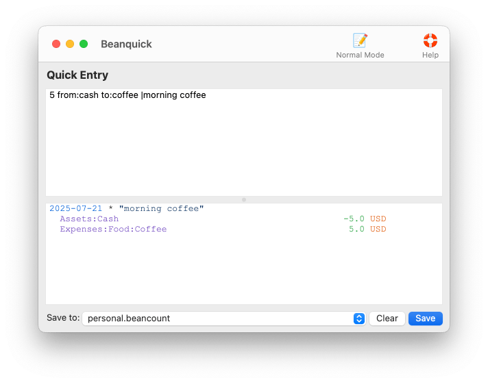
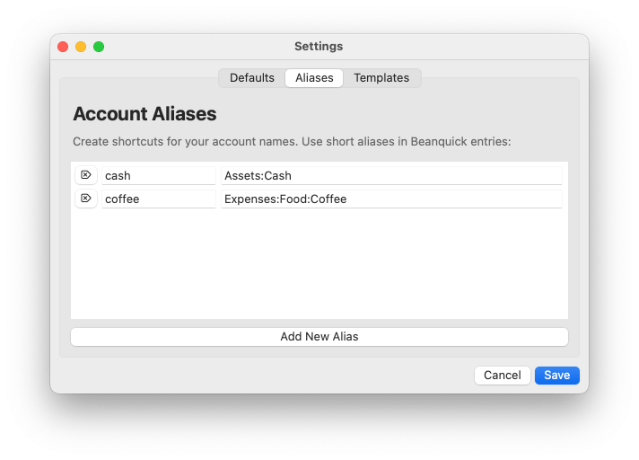
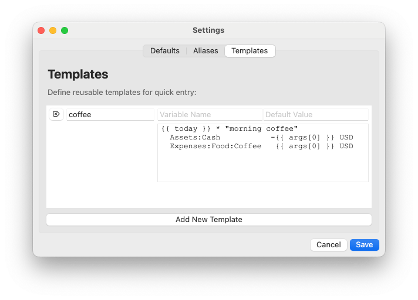
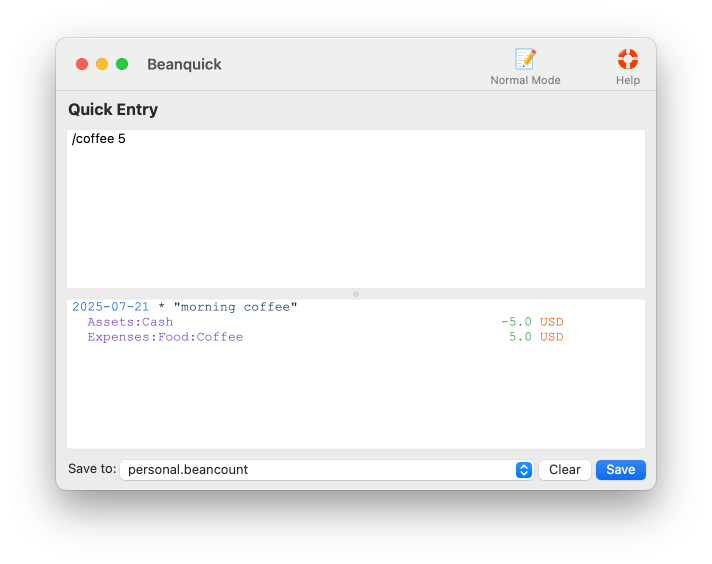
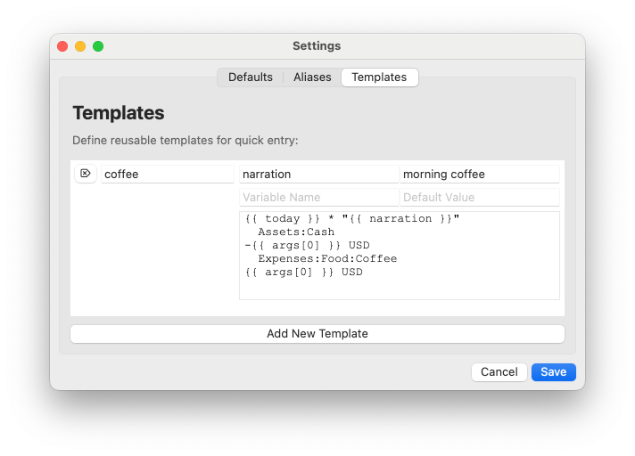

# Beanquick 用户手册

欢迎使用 Beanquick！

## 目录

1.  [什么是 Beanquick？](#什么是-beanquick)
2.  [快速入门](#快速入门)
3.  [基本语法](#基本语法)
4.  [交易指令](#交易指令)
5.  [其他指令](#其他指令)
6.  [模板](#模板)
7.  [快速参考](#快速参考)
8.  [获取更多帮助](#获取更多帮助)

---

## 什么是 Beanquick？

Beanquick 提供一种快速、直观的语法，用于输入复式记账交易，并编译为 **Beancount** 格式。您无需编写冗长的 Beancount 条目，只需使用简单、自然的语言来记录您的金融交易，Beanquick 将自动将其转换为格式正确的 Beancount 条目。

[Beancount](https://github.com/beancount/beancount/)

---

## 快速入门

### 输入模式

Beanquick 提供两种方式来输入您的财务数据：

**快速模式 (Beanquick 语法)**
- 使用简单语法进行快速、自然的语言输入
- 当您熟悉语法时，非常适合快速数据录入

**普通模式 (基于表单的输入)**
- 带有账户自动补全功能的引导式表单
- 用于日期、账户、金额等的结构化字段
- 适合初学者或处理复杂交易

> 💡 **提示：** 随时按下 `Cmd+/` (macOS) 或 `Ctrl+/` (Windows/Linux) 即可在两种模式之间切换。

本手册侧重于快速模式的语法，但两种模式创建的 Beancount 条目是相同的。

### 在快速模式下完成您的第一笔交易

> 💡 **开始之前：** 请确保您处于快速模式。请按 `Cmd+/` (macOS) 或 `Ctrl+/` (Windows/Linux) 进行切换。

让我们从最简单的交易开始——买咖啡：

```beanquick
5 from:cash to:coffee |morning coffee
```

这记录了从您的现金账户中支出 `$5` 用于购买咖啡，其中 `morning coffee` 是交易描述。

这会编译为以下 Beancount 条目：

```beancount
2025-07-21 * "morning coffee"
  Assets:Cash                          -5.0 USD
  Expenses:Food:Coffee                  5.0 USD
```

让我们看看实际效果：


### 工作原理

Beanquick 使用**账户别名**将简单的名称转换为完整的 Beancount 账户：

**账户展开：**
- `cash` → `Assets:Cash`
- `coffee` → `Expenses:Food:Coffee`

这些别名在您的设置中配置：

> 💡 **提示：** 按 `Cmd+,` (macOS) 或 `Ctrl+,` (Windows/Linux) 打开设置并定义您自己的账户别名。



**复式记账原则：**
- 每笔交易有一个来源账户 (`from:`) 和一个或多个目标账户 (`to:`)
- 所有金额必须平衡——总支出等于总收入
- 在此示例中：`$5` 从现金账户流出 (`Assets:Cash -$5`)，同时 `$5` 进入咖啡支出账户 (`Expenses:Food:Coffee +$5`)

**[返回顶部](#beanquick-用户手册)**

---

## 基本语法

### 核心结构

```
[@日期] 金额 [货币] from:账户 [{元数据}] to:账户 [{元数据}] [|收款人|描述] [#标签] [^链接] [{元数据}]
```

### 必需元素

1.  **金额**: 资金流动的数额
2.  **来源账户**: 资金的来源
3.  **目标账户**: 资金的去向

### 可选元素

-   **日期**: 交易发生的时间
-   **货币**: 使用的货币种类
-   **收款人/描述**: 交易对象和内容
-   **标签**: 用于分类
-   **链接**: 用于关联相关交易
-   **元数据**: 额外的结构化数据

**[返回顶部](#beanquick-用户手册)**

---

## 交易指令

> **💡 提示：**：在输入交易之前，请在“设置”中配置好您的账户别名。

### 1. 基本支出

`金额 from:来源账户 to:支出账户`

```
25 from:cash to:food
50 from:checking to:gas
100 from:credit to:shopping
```

### 2. 账户间转账

`金额 from:来源账户 to:目标账户`

```
100 from:checking to:savings
500 from:savings to:checking
50 from:wallet to:checking
```

### 3. 收入记录

`金额 from:收入账户 to:资产账户`

```
3000 from:salary to:checking
50 from:interest to:savings
100 from:dividend to:checking
```

### 4. 附带日期

`@日期 金额 from:账户 to:账户`

```
@yesterday 25 from:cash to:food
@2024-01-15 100 from:checking to:rent
@today 50 from:credit to:gas
```

**日期格式**:
- `@today` - 今天
- `@yesterday` - 昨天
- `@2024-01-15` - 特定日期 (YYYY-MM-DD)
- `@today-5d` - 5天前 (支持日期计算)

更多日期格式，请参阅 [日期格式](#日期格式) 部分。

### 5. 附带货币

`金额 货币 from:账户 to:账户`

```
25 USD from:cash to:food
100 EUR from:checking to:savings
50 GBP from:wallet to:transport
```

### 6. 附带收款人和描述

`金额 from:账户 to:账户 |收款人|描述`

```
25 from:cash to:food |Starbucks|Morning coffee
50 from:credit to:gas |Shell|Fill up tank
100 from:checking to:utilities |Electric Company|Monthly bill
```

**收款人/描述格式**:
- `|Coffee` - 仅描述
- `|Starbucks|Morning coffee` - 收款人和描述

### 7. 附带标签和链接

`金额 from:账户 to:账户 #标签 ^链接`

```
25 from:cash to:food #dining
100 from:checking to:savings ^savings-goal
50 from:credit to:gas #transport ^car-expenses
```

**多个标签/链接**:
```
25 from:cash to:food #dining #weekend ^date-night
```

### 8. 附带元数据


元数据可以使用 `{键:值}` 块附加到交易、`from` 账户或任何 `to` 账户。

**示例：**

- **交易级别元数据** (应用于整个交易):
  ```
  25 from:cash to:food #dining {receipt:ABC123 location:"Cafe"}
  ```

- **来源账户元数据**:
  ```
  100 from:checking {method:"mobile app"} to:savings
  ```

- **目标账户元数据**:
  ```
  50 from:credit to:gas {odometer:45000 trip:"vacation"}
  200 from:cash to:food 100 {category:groceries} to:transport {mode:bus}
  ```

您可以根据需要混合使用元数据块：
```
@2024-07-21 75 from:checking {atm:Bank123} to:food {receipt:ABC123} {note:Dinner}
```

### 9. 多目标账户

`总金额 from:账户 to:账户1 金额1 to:账户2 金额2`

```
100 from:checking to:savings 60 to:investment 40
200 from:cash to:food 75 to:transport 25 to:entertainment 100
```

**[返回顶部](#beanquick-用户手册)**

---

## 其他指令

### 余额断言

验证您的账户余额是否与记录相符：

`[@日期] bal 账户 金额 货币`

```
bal checking 1000 USD
@today bal savings 5000 USD
@2024-01-01 bal cash 200 USD
```

### 填充声明

使用期初权益自动平衡账户：

`[@日期] pad from:账户 to:权益账户`

```
pad from:checking to:equity
@2024-01-01 pad from:savings to:equity
```

### 价格声明

记录商品价格：

`[@日期] px 商品 金额 货币`

```
px AAPL 150 USD
@today px GOOGL 2500 USD
@2024-01-15 px MSFT 300 USD
```

### 复杂交易

结合多种功能：

```
@yesterday 75.50 USD from:checking to:food 25 to:transport 50.50 |Restaurant|Dinner with friends #dining #social ^date-night {tip: 15 rating: 5}
```

**[返回顶部](#beanquick-用户手册)**

---

## 模板

Beanquick 不仅能处理简单的交易，它还能让您能定义和复用 Beancount 模板。这意味着复杂的记账条目也能轻松录入，大幅节省您的时间和重复性工作。

### 什么是模板？

模板是可复用的交易模式，由强大的模板引擎 **Jinja2** 驱动。您可以将它们视为智能快捷方式，使之：

-   一次生成多个交易
-   自动计算金额
-   使用变量和逻辑
-   轻松处理周期性交易

[Jinja2](https://jinja.palletsprojects.com/)

### 您的第一个模板

模板通过以正斜杠 (`/`) 开头的命令来调用，并生成完整的 Beancount 条目。

**基本语法**: `/模板名称 [参数]`

**模板定义** (在“设置”中进行配置):
```
{{ today }} * "morning coffee"
  Assets:Cash                    -{{ args[0] }} USD
  Expenses:Food:Coffee            {{ args[0] }} USD
```


**用法**:
```
/coffee 5
```

**生成**:
```beancount
2025-07-21 * "morning coffee"
  Assets:Cash                           -5.0 USD
  Expenses:Food:Coffee                   5.0 USD
```

让我们看看实际效果：


### 模板工作原理

让我们来分解一下模板语法的工作方式：

```
 |-> Jinja2 变量占位符
 |
 |   |-> 系统变量：将被替换为实际值
 |   |
{{ today }} * "morning coffee"
  Assets:Cash                -{{ args[0] }} USD
  Expenses:Food:Coffee        {{ args[0] }} USD
                                   |
                                   |-> 第一个命令参数 (例如, 5)
```

> **💡 提示：** 把 `{{ }}` 想象成“填空”，当您运行模板时，它们会被替换为真实的值。

在编写模板时，Beanquick 提供了三种可以使用的变量类型：

**1. 系统变量**
-   **`datetime`** - 用于日期/时间操作的 Python `datetime` 模块
-   **`today`** - ISO 格式的今天日期 (例如, "2025-07-21")
-   **`yesterday`** - ISO 格式的昨天日期 (例如, "2025-07-20")

**2. 来自命令行的参数**

当您输入 `/coffee 5 "matcha tea"` 时，这些参数会变为：
-   `{{ args[0] }}` = `5`
-   `{{ args[1] }}` = `"matcha tea"`

**3. 您配置的默认值**

在您的模板设置中，您可以设置默认值，使模板更智能：



#### 覆盖默认值

您可以使用命名参数来覆盖任何默认值：

```
/coffee 5                           # 使用默认描述
/coffee 5 narration="matcha tea"    # 覆盖描述
```

**带覆盖的示例：**
```
/coffee 5 narration="matcha tea"
```

**变为：**
```beancount
2025-07-21 * "matcha tea"
  Assets:Cash                  -5.0 USD
  Expenses:Food:Coffee          5.0 USD
```

在这个例子中，交易描述从 `morning coffee` (默认值) 变为了 `matcha tea` (覆盖值)。

> 💡 **提示：** 系统变量无法被覆盖。

**[返回顶部](#beanquick-用户手册)**

---

## 快速参考

### 基本交易
```
金额 from:账户 to:账户
```

### 多目标账户
```
总金额 from:账户 to:账户1 金额1 to:账户2 金额2
```

### 包含所有选项的格式
```
@日期 金额 货币 from:账户 {键:值} to:账户 {键:值} |收款人|描述 #标签 ^链接 {键:值}
```

### 其他声明
```
bal 账户 金额 货币                  # 余额断言
pad from:账户 to:权益账户           # 填充声明
px 商品 金额 货币                   # 价格声明
/模板名称 [参数]                    # 展开模板
```

### 日期格式

**支持的日期格式：**
- `@today`, `@yesterday`, `@tomorrow` — 相对日期
- `@2024-01-15` — 特定日期 (YYYY-MM-DD)
- `@2024-01` — 月份 (YYYY-MM)
- `@2024` — 年份
- `@2024-Q1`, `@2024-W42`, `@FY2024`, `@FY2024-Q2` — 季度、周、财年、财季
- `@day+5`, `@day-2w`, `@2024-01-15+3d` — 算术运算 (加/减 日、周、月、年、季度)
- `@"end of 2024-Q1"`, `@"middle of 2024-01"` — 位置修饰符 (期初、期末、期中)
- `@"N days ago"`, `@"N weeks from now"` — 自然语言相对日期

**[返回顶部](#beanquick-用户手册)**

---

## 获取更多帮助

-   **Telegram 群组**: 欢迎加入 Beanquick 用户群组，获取实时帮助、技巧和讨论。 [Telegram 群组](https://t.me/beanquick)
    
-   **GitHub 仓库**: 访问 Beanquick 的 GitHub 仓库，查看源代码、问题和更新。 [Beanquick GitHub 仓库](https://github.com/TwoBitsWare/Beanquick)
-   **Beancount 文档**: 参考 Beancount 文档，了解其底层的会计原则和高级用法。[Beancount 文档](https://beancount.github.io/docs/)

---

**[返回顶部](#beanquick-用户手册)**
